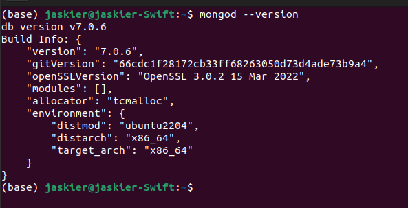
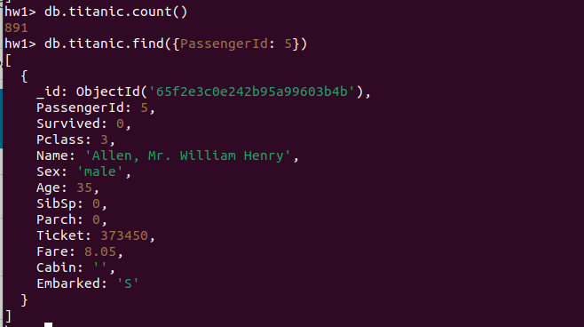
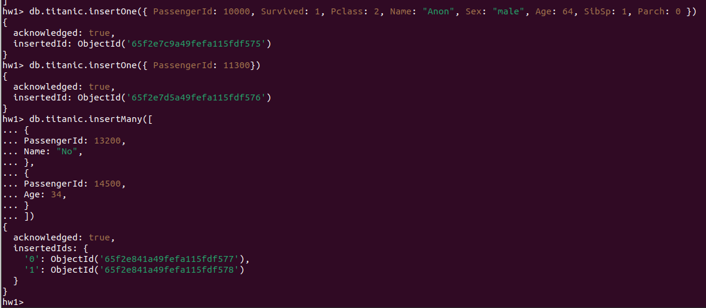
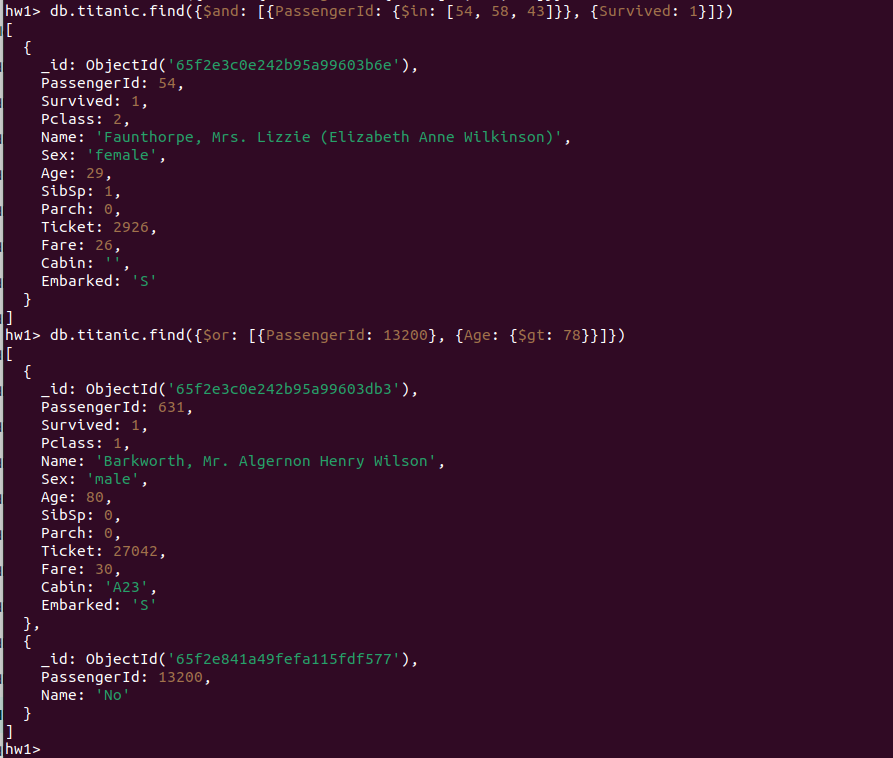
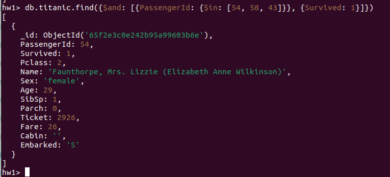
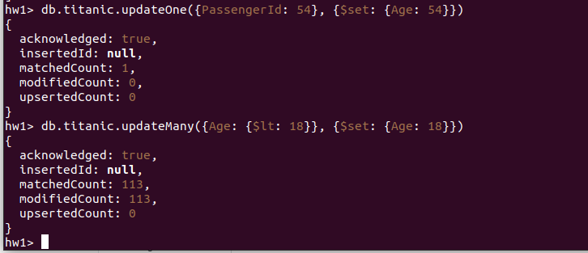
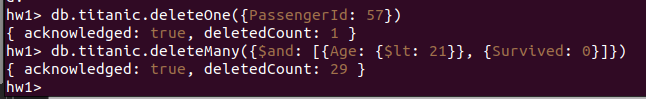
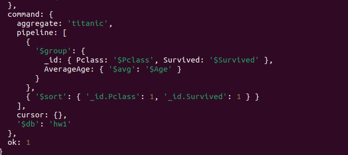
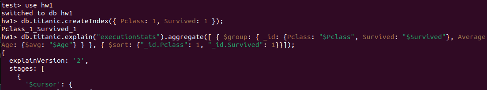

# Homework 1

## Установка MongoDB

1. Найдена документация по установке
2. Выполнены все представленные команды по установке MongoDB на локальный компьютер с ОС Ubuntu 22.04

## Создание и заполнение БД

1. Запущен процесс mongod через команду: sudo systemctl start mongod
2. Командой 'sudo systemctl status mongod' была проверена успешность запуска сервера
3. Запущена сессия командой 'mongosh'. Предварительно был удален файл /tmp/mongodb-27017.txt и перезапущен сервер для устранения ошибки 'connect ECONNREFUSED 127.0.0.1:27017'
4. Создана таблица командой db.createCollection("titanic") и выведена некоторая статистика
5. Скачан датасет titanic (train-часть). Командой 'mongoimport -d hw1 -c titanic --type csv --file data/titanic_train.csv --headerline' данные с файла были импотированы в hw1.titanic
6. Было выведено количество документов в коллекции и документ с passengerId = 5

## CRUD-операции
 
1. На следующем скриншоте показано несколько операций вставок с помощью insertOne() и insertMany() (create)

2. На следующих скриншотах показана пара комплексных запросов find (read)

3. На следующем скриншоте показаны операции обновления одного и нескольких объектов (update)

4. На следующем скриншоте показаны операции удаления одного и нескольких объектов (delete)

## Индексирование

1. Для оценки индексов был выбран запрос, группирующий данные по полям Pclass и Survived, рассчитывающий средний возраст в каждой группе. Для оценки производительности дополнительно вызывается команда .explain("executionStats") и оценивается поле executionTimeMillis

executionTimeMillis = 18

2. Создаем композитный индекс для полей Pclass и Survived, выполняем тот же запрос и заново оцениваем производительность

executionTimeMillis = 1

